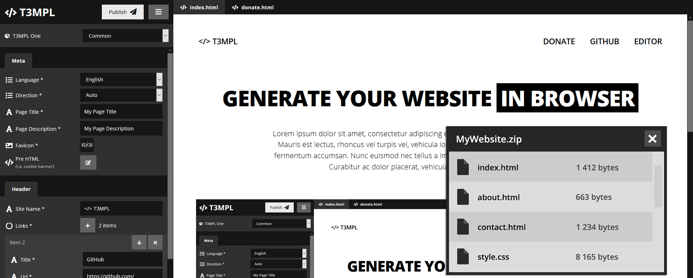

# T3MPL Editor

[](https://travis-ci.org/b4rtaz/t3mpl-editor) [](/LICENSE) [](https://twitter.com/b4rtaz)

T3MPL is a super simple static website generator. To generate a website you need just a browser (or nodejs). Choose a website template and edit it by T3MPL Editor. In 3 minutes you will get a final website zip file. You need only upload generated files to your server. Moreover, T3MPL is totally free and open source.

* 🍕 [Open T3MPL Editor](http://t3mpl.n4no.com/editor/#manifest=../templates/t3mpl-one/template.yaml)
* ☕ [Browse T3MPL Templates](http://t3mpl.n4no.com/)

If you want to use T3MPL from command line, check [T3MPL Core](https://github.com/b4rtaz/t3mpl-core) repository.

All available templates on project website comes from [T3MPL Templates](https://github.com/b4rtaz/t3mpl-templates) repository.

## ⚙️ How to Run

[Node.js](https://nodejs.org/en/) is required.

#### Development

```
npm install
npm run start
```

To open a template from `src/templates/` directory add `#manifest=path` to URL.

`http://localhost:4200/#manifest=templates/boilerplate/template.yaml`

#### Build

```
npm install
npm run build
```

## 🤝 Contributing

Contributions, issues and feature requests are welcome!

## 💡 License

This project is released under the MIT license.
